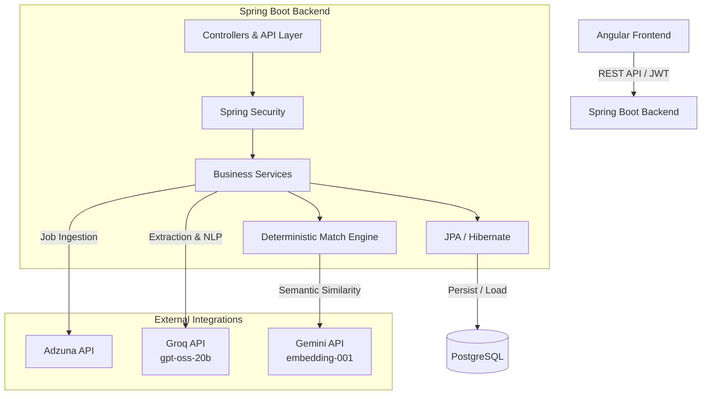
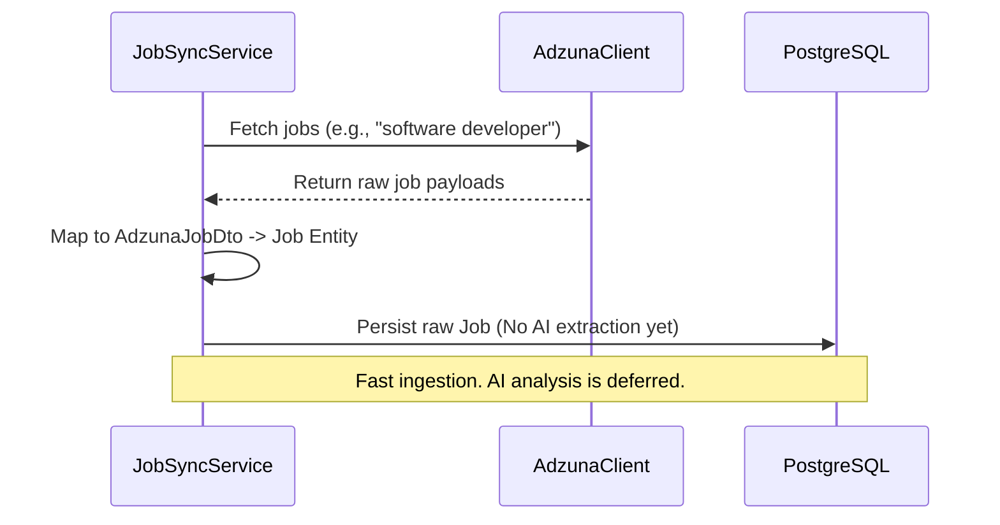
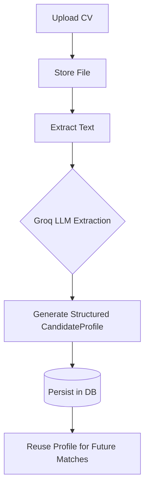
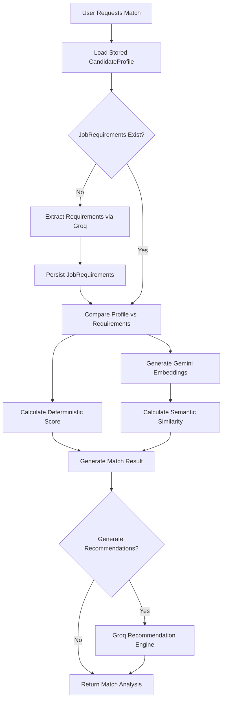

# CareerMatch Backend

> **Know Your Fit. Build What's Missing.**

The backend service for **CareerMatch**, an AI-powered career intelligence platform designed to help university students, fresh graduates, and entry-level job seekers understand how well their CV matches a target job, identify skill gaps, and receive actionable improvement recommendations.

---

## 1. Project Overview

CareerMatch addresses a critical challenge for early-career professionals: deciphering whether their CV actually aligns with a specific job description and understanding precisely what they are missing.

Unlike platforms that rely on opaque AI "black boxes" to spit out arbitrary scores, CareerMatch integrates **LLM-driven natural language understanding (Groq)** and **semantic embeddings (Gemini)** with a **deterministic backend scoring engine**. This hybrid approach ensures intelligent requirement extraction without sacrificing predictable, evidence-based matching logic.

The backend is built with Java and Spring Boot, serving an Angular frontend via a secure, structured REST API.

---

## 2. Key Features

*   **Integrated AI Processing:** Native backend integration with Groq (for structured data extraction) and Gemini (for semantic embeddings).
*   **Intelligent CV Parsing:** Transforms raw CV text into a structured, reusable `CandidateProfile`.
*   **Dynamic Job Ingestion:** Fast, lightweight synchronization with external job boards (Adzuna) without bottlenecking on AI analysis.
*   **Evidence-Based Match Analysis:** Deterministic scoring logic combined with semantic similarity, driven entirely by traceable evidence from the CV and Job Description.
*   **Actionable AI Recommendations:** Context-aware improvement plans highlighting critical skill gaps, required effort, and expected score gains.
*   **Robust Security:** JWT-based authentication, role-based access, and refresh token rotation.
*   **Reliable Persistence:** Relational data integrity powered by PostgreSQL and Flyway migrations.

---

## 3. System Architecture

CareerMatch operates on a modern, decoupled architecture where AI acts as a supporting intelligence layer orchestrated by the Spring Boot backend.



---

## 4. End-to-End AI Matching Pipeline

The core product flow intelligently balances performance and AI utilization. Extracted profiles and job requirements are cached and persisted in the database to minimize redundant API calls.

```text
Discover Job ──► Understand Requirements ──► Upload CV ──► Analyze Fit ──► Get Recommendations

```

---

## 5. Job Ingestion Architecture

Job synchronization is intentionally **lightweight and fast**.

When jobs are pulled from the Adzuna API, the system maps the raw data (title, description, company, location, salary, URL, posting date) directly into the database.

* **No Groq calls** are made during ingestion.
* **No AI skill extraction** is performed.
* **No embeddings** are generated.

This design prevents unnecessary AI token usage and ensures high throughput. The raw description is preserved so it can be intelligently analyzed *only* when a user requests a match against it.



---

## 6. CV Processing Architecture

CV processing occurs immediately upon upload, creating a structured, reusable profile.

1. **Upload & Store:** CV file is uploaded and saved securely.
2. **Extract Text:** Backend parses raw text from the document.
3. **AI Analysis:** Text is sent to Groq for structured extraction.
4. **Profile Generation:** Returns a `CandidateProfile` containing skills, experience (months/summary), past titles, projects, education, certifications, and languages.
5. **Persistence:** The profile is saved. Future match requests reuse this profile, preventing redundant Groq parsing.



---

## 7. Match Analysis Architecture

The Match Analysis flow combines deterministic business rules with AI insights. If a selected job hasn't been analyzed yet, Groq is called on-the-fly to extract its requirements.



---

## 8. AI Responsibility Breakdown

To prevent AI hallucinations from skewing core product metrics, intelligence boundaries are strictly enforced.

| Provider / Layer | Responsibilities |
| --- | --- |
| **Groq (gpt-oss-20b)** | • Structured CV profile extraction<br>

<br>• Job requirement extraction (required vs. preferred)<br>

<br>• Natural language understanding<br>

<br>• Contextual recommendation generation |
| **Gemini (embedding-001)** | • Generating semantic embeddings<br>

<br>• Cosine similarity calculations |
| **Spring Boot Backend** | • Orchestration and API routing<br>

<br>• Database persistence and relational integrity<br>

<br>• **Deterministic score calculation**<br>

<br>• Skill/Experience/Project evaluation<br>

<br>• Security and Authorization |

---

## 9. Deterministic Scoring

The match score is **not** a raw number generated by asking an LLM "what is the score?". It is a deterministically calculated metric based on traceable evidence.

### Dynamic Weighting System

Base weights are defined as follows:

* **Required Skills:** 40%
* **Experience:** 20%
* **Projects:** 15%
* **Education:** 10%
* **Semantic Similarity:** 10%
* **Preferred Skills:** 5%

**Crucial Logic:** The backend implementation *dynamically normalizes* these weights based on available job evidence. If a job does not specify an education requirement, the "Education" component is removed from the equation, and the remaining weights are proportionally scaled up. This prevents users from earning "free points" for criteria the employer doesn't care about.

---

## 10. Semantic Similarity

While the deterministic engine checks for exact and normalized skill matches, the semantic engine catches nuanced alignments.

Using `gemini-embedding-001`, the backend generates vector embeddings for:

1. **Candidate Context:** A synthesized string of skills, experience, projects, past titles, and education.
2. **Job Context:** The complete job description, required/preferred skills, and responsibilities.

The system then calculates the cosine similarity between these two vectors. This score feeds directly into the normalized deterministic scoring model, providing a safety net for varied terminology (e.g., "React.js" vs. "Frontend Web Technologies").

---

## 11. Recommendation Engine

Recommendations are treated as an **enhancement layer** built on top of the successful match pipeline.

Using Groq, the backend synthesizes the `CandidateProfile`, the structured `JobRequirements`, and the calculated score gaps to generate actionable advice.

Recommendations provide:

* **Identified skill gaps** (categorized and prioritized)
* **Job vs. CV Evidence** (why this matters)
* **Recommended Actions & Deliverables**
* **Estimated Effort & Expected Score Gain**

*Architecture Note:* A failure in the recommendation generation process (e.g., an LLM rate limit) will gracefully degrade; it does not invalidate the successfully calculated deterministic match score.

---

## 12. Technology Stack

| Component | Technology |
| --- | --- |
| **Language** | Java 17+ |
| **Framework** | Spring Boot 3.2.0 |
| **Database** | PostgreSQL |
| **ORM / Data Access** | Spring Data JPA, Hibernate |
| **Database Migrations** | Flyway |
| **Security** | Spring Security, JWT |
| **External APIs** | Adzuna, Groq, Google Gemini |
| **API Documentation** | Swagger / OpenAPI (SpringDoc) |
| **Build Tool** | Maven Wrapper |
| **Boilerplate Reduction** | Lombok |

---

## 13. Project Structure

The codebase is organized by domain and technical responsibility:

```text
backend/
├── src/
│   ├── main/
│   │   ├── java/
│   │   │   ├── com/
│   │   │       ├── example/
│   │   │           ├── backend/
│   │   │               ├── config/
│   │   │               │   ├── AdzunaConfig.java
│   │   │               │   ├── AsyncConfig.java
│   │   │               │   ├── AuditConfig.java
│   │   │               │   ├── CacheConfig.java
│   │   │               │   ├── CorsConfig.java
│   │   │               │   ├── GeminiConfig.java
│   │   │               │   ├── GroqConfig.java
│   │   │               │   ├── OpenApiConfig.java
│   │   │               │   ├── RestClientConfig.java
│   │   │               │   └── SecurityConfig.java
│   │   │               ├── controller/
│   │   │               │   ├── AuthController.java
│   │   │               │   ├── CVController.java
│   │   │               │   ├── JobController.java
│   │   │               │   ├── MatchController.java
│   │   │               │   └── UserController.java
│   │   │               ├── dto/
│   │   │               │   ├── ai/
│   │   │               │   │   ├── CandidateProfileDto.java
│   │   │               │   │   ├── JobRequirementsDto.java
│   │   │               │   │   └── RecommendationDto.java
│   │   │               │   ├── request/
│   │   │               │   │   ├── CVUploadRequest.java
│   │   │               │   │   ├── ChangePasswordRequest.java
│   │   │               │   │   ├── LoginRequest.java
│   │   │               │   │   ├── MatchAnalysisRequest.java
│   │   │               │   │   ├── RefreshTokenRequest.java
│   │   │               │   │   ├── RegisterRequest.java
│   │   │               │   │   ├── UpdateProfileRequest.java
│   │   │               │   │   ├── UpdateRecommendationStatusRequest.java
│   │   │               │   │   └── UpdateSettingsRequest.java
│   │   │               │   ├── response/
│   │   │               │       ├── ApiResponse.java
│   │   │               │       ├── AuthResponse.java
│   │   │               │       ├── CVProfileResponse.java
│   │   │               │       ├── CVResponse.java
│   │   │               │       ├── CVStatusResponse.java
│   │   │               │       ├── ErrorResponse.java
│   │   │               │       ├── ImprovementPlanResponse.java
│   │   │               │       ├── JobListResponse.java
│   │   │               │       ├── JobResponse.java
│   │   │               │       ├── MatchAnalysisResponse.java
│   │   │               │       ├── MatchHistoryResponse.java
│   │   │               │       ├── UserResponse.java
│   │   │               │       └── UserSettingsResponse.java
│   │   │               ├── exception/
│   │   │               │   ├── AdzunaApiException.java
│   │   │               │   ├── GlobalExceptionHandler.java
│   │   │               │   ├── LLMException.java
│   │   │               │   ├── ResourceNotFoundException.java
│   │   │               │   ├── UnauthorizedException.java
│   │   │               │   └── ValidationException.java
│   │   │               ├── model/
│   │   │               │   ├── CV.java
│   │   │               │   ├── ImprovementRecommendation.java
│   │   │               │   ├── Job.java
│   │   │               │   ├── MatchResult.java
│   │   │               │   ├── RefreshToken.java
│   │   │               │   ├── Skill.java
│   │   │               │   └── User.java
│   │   │               ├── repository/
│   │   │               │   ├── CVRepository.java
│   │   │               │   ├── ImprovementRecommendationRepository.java
│   │   │               │   ├── JobRepository.java
│   │   │               │   ├── MatchResultRepository.java
│   │   │               │   ├── RefreshTokenRepository.java
│   │   │               │   ├── SkillRepository.java
│   │   │               │   └── UserRepository.java
│   │   │               ├── security/
│   │   │               │   ├── CustomUserDetails.java
│   │   │               │   ├── JwtAuthenticationFilter.java
│   │   │               │   ├── JwtService.java
│   │   │               │   ├── RestAccessDeniedHandler.java
│   │   │               │   ├── RestAuthenticationEntryPoint.java
│   │   │               │   └── UserDetailsServiceImpl.java
│   │   │               ├── service/
│   │   │               │   ├── adzuna/
│   │   │               │   │   ├── AdzunaClient.java
│   │   │               │   │   ├── AdzunaJobDto.java
│   │   │               │   │   ├── AdzunaResponseDto.java
│   │   │               │   │   └── AdzunaService.java
│   │   │               │   ├── ai/
│   │   │               │   │   ├── AIAnalysisService.java
│   │   │               │   │   ├── EmbeddingService.java
│   │   │               │   │   ├── LLMService.java
│   │   │               │   │   ├── PromptBuilder.java
│   │   │               │   │   ├── ScoringService.java
│   │   │               │   │   └── SkillNormalizationService.java
│   │   │               │   ├── AuthService.java
│   │   │               │   ├── CVProcessingService.java
│   │   │               │   ├── CVService.java
│   │   │               │   ├── EmailService.java
│   │   │               │   ├── FileStorageService.java
│   │   │               │   ├── JobService.java
│   │   │               │   ├── JobSyncService.java
│   │   │               │   ├── MatchService.java
│   │   │               │   ├── PDFExtractionService.java
│   │   │               │   ├── RecommendationService.java
│   │   │               │   └── UserService.java
│   │   │               ├── util/
│   │   │               │   ├── DateUtils.java
│   │   │               │   ├── JsonUtils.java
│   │   │               │   ├── SecurityUtils.java
│   │   │               │   └── StringUtils.java
│   │   │               └── BackendApplication.java
│   │   ├── resources/
│   │       ├── db/
│   │       │   ├── migration/
│   │       │       ├── V1__init_schema.sql
│   │       │       ├── V2__seed_users.sql
│   │       │       ├── V3__seed_skills.sql
│   │       │       ├── V4__seed_jobs.sql
│   │       │       ├── V5__seed_test_data.sql
│   │       │       ├── V6__add_job_requirements.sql
│   │       │       └── V7__fix_cv_filename_unique_constraint.sql
│   │       ├── prompts/
│   │       │   ├── candidate-profile-prompt.txt
│   │       │   ├── job-requirements-prompt.txt
│   │       │   └── recommendations-prompt.txt
│   │       ├── application-test.properties
│   │       └── application.properties
│   ├── test/
│       ├── java/
│           ├── com/
│               ├── example/
│                   ├── backend/
│                       └── BackendApplicationTests.java
├── README.md
├── docker-compose.yml
├── mvnw
├── mvnw.cmd
├── pom.xml
└── test-api.ps1

```

---

## 14. Database Architecture

Data integrity is enforced using PostgreSQL and managed via Flyway migrations.

### Current Flyway Migrations

* `V1__init_schema.sql` - Core tables (Users, CVs, RefreshTokens)
* `V2__seed_users.sql` - Initial user seeding
* `V3__seed_skills.sql` - Base skill dictionaries
* `V4__seed_jobs.sql` - Seed test jobs
* `V5__seed_test_data.sql` - Base application test data
* `V6__add_job_requirements.sql` - Schema updates for AI parsed Job Requirements (JSON storage)
* `V7__fix_cv_filename_unique_constraint.sql` - Complex unique constraints for CVs.

**V7 Constraint Logic Details:**
The database ensures CV filename uniqueness per user while allowing logical flexibility:

* Same User + Same Active Filename = **Rejected**
* Same User + Different Filename = **Allowed**
* Different Users + Same Filename = **Allowed**
* Same User + Previously Soft-Deleted Filename = **Allowed** (Filename can be reused).

---

## 15. Authentication & Security

The platform secures endpoints using **Spring Security** and **JWT (JSON Web Tokens)**.

* **Stateless Authentication:** Every protected endpoint requires a valid Bearer token.
* **Token Rotation:** Short-lived access tokens are paired with database-backed refresh tokens (`RefreshToken` entity).
* **Centralized Handling:** Unauthorized access and token expiries are caught by the `RestAuthenticationEntryPoint` and custom `GlobalExceptionHandler`.
* **Environment Safety:** Database credentials, JWT secrets, Groq API keys, and Gemini keys are injected via environment variables. *No credentials are ever committed to the repository.*

---

## 16. API Documentation

Comprehensive endpoint documentation and testing interfaces are provided by Swagger UI.

When running locally, access the interactive documentation at:

`http://localhost:8080/swagger-ui/index.html`

Domains documented include Authentication, Users, CVs, Jobs, and Match Analysis.

---

## 17. Configuration

Configuration is managed via Spring profiles (`application.properties`, `application-dev.properties`, `application-prod.properties`).

Required Environment Variables:

```env
DB_HOST=localhost
DB_PORT=5432
DB_NAME=careermatch
DB_USERNAME=postgres
DB_PASSWORD=<secure_db_password>

JWT_SECRET=<secure_jwt_secret>

GROQ_API_KEY=<groq_key>
GEMINI_API_KEY=<gemini_key>
ADZUNA_APP_ID=<adzuna_app_id>
ADZUNA_APP_KEY=<adzuna_app_key>

```

---

## 18. Docker / Local Development

The local development infrastructure relies on **Docker Compose solely for supporting infrastructure** (the database). The Spring Boot application itself runs natively on the host machine.

The provided `docker-compose.yml` spins up:

1. **PostgreSQL 15+**
2. **pgAdmin** (for visual database management)

```bash
# Start the database infrastructure
docker-compose up -d

```

---

## 19. Installation & Running

### Prerequisites

* Java 17 or higher
* Docker (for PostgreSQL) or a local PostgreSQL instance
* Git

### Steps

1. **Clone the repository:**
```bash
git clone [https://github.com/omaryasser3060/CareerMatch---backend.git](https://github.com/omaryasser3060/CareerMatch---backend.git)
cd CareerMatch---backend

```


2. **Start the Database:**
```bash
docker-compose up -d

```


3. **Build the Project:**
   Uses the included Maven Wrapper (no global Maven installation required).
```bash
./mvnw clean compile   # Linux / macOS
.\mvnw.cmd clean compile # Windows

```


4. **Run the Backend:**
```bash
./mvnw spring-boot:run

```


The server will start on `http://localhost:8080`.

---

## 20. Testing

The project includes a standard Maven testing directory structure. Run the test suite using:

```bash
./mvnw test

```

Current test coverage includes repository validations, core deterministic scoring logic verification, and JWT security filters.

---

## 21. Current Implementation Status

**✅ Fully Implemented:**

* REST API foundation & PostgreSQL persistence via Flyway.
* JWT Auth & Refresh Token lifecycle.
* Adzuna Job Ingestion (Lightweight syncing).
* AI CV Parsing (Groq) & Structured Profile generation.
* AI Job Requirement Extraction (Groq).
* Semantic Similarity generation (Gemini Embeddings).
* Dynamic, evidence-based Deterministic Scoring Engine.
* AI Recommendation Generation (Groq).
* Swagger UI integration.

**🚀 Future Improvements:**

* Webhooks for async AI pipeline processing.
* Expanding external job provider integrations beyond Adzuna.
* Caching layers (e.g., Redis) for heavily queried global job listings.
* Production CI/CD pipelines and containerization for the Spring Boot application itself.

---

## 22. Development Principles

1. **AI is an Enabler, Not a Black Box:** AI handles extraction, summarization, and natural language understanding. It does *not* arbitrarily dictate the user's final match score.
2. **Protect the User's API Quota:** Job ingestion bypasses AI. Profiles and requirements are extracted once and cached securely in the database.
3. **Strict Data Integrity:** Robust relational models, cascading constraints, and complex indexing (like the V7 CV filename fix) ensure platform stability.
4. **Security First:** No secrets in source control. Everything runs through strict JWT filters.

```
